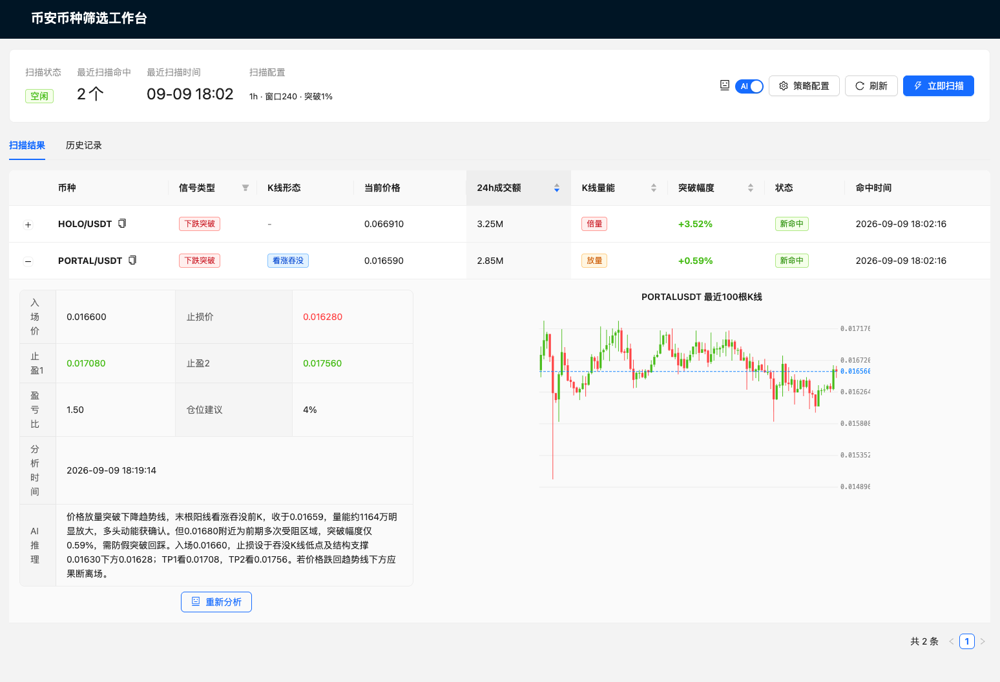

# Trading Workbench | 交易工作台

[English](#english) | [中文](#中文)

> ⚠️ **免责声明 / Disclaimer**
> 本软件仅供学习与研究使用，**不构成任何投资建议**。加密货币合约交易风险极高，可能导致全部本金损失。请自行研究并自负盈亏。
> This software is for educational and research purposes only and is **NOT financial advice**. Cryptocurrency futures trading carries substantial risk and may result in the total loss of capital. Always do your own research.

---

<a id="english"></a>

## English

A cryptocurrency futures signal-scanning workbench with AI-assisted trading analysis. It scans Binance USDT-M perpetual futures contracts on an hourly schedule, detects three technical signal strategies, and optionally calls an OpenAI-compatible model to produce entry / stop-loss / take-profit suggestions with a K-line chart and per-row AI analysis UI.

<p align="center">
  
</p>

### Features

- **Automated hourly scan** — Celery beat triggers a scan at minute 2 of each hour (after the 1h candle closes). Manual triggering is also supported from the UI.
- **Binance futures market** — Pulls USDT-M perpetual symbols, 24h quote volume, and K-line data from the Binance futures API (`/fapi/v1/...`). Results are sorted by 24h volume by default.
- **Three signal strategies**:
  - `downtrend_breakout` — Bearish breakout detection.
  - `range_bound` — Range-bound market detection.
  - `uptrend_pullback` — Uptrend pullback entry detection.
  Swing points are computed from **closing prices** to filter shadow noise.
- **K-line pattern detection** — Recognizes hammer, inverted hammer, bullish/bearish engulfing, morning star, piercing line, close-above-prev-high, etc.
- **Latest-candle volume classification** — Classifies the latest closed candle volume as 倍量 / 放量 / 平量 / 缩量 / 地量 (extreme/expanding/flat/shrinking/dust).
- **AI analysis (optional)** — One-click per-row AI analysis. Sends the signal context plus the last 100 K-lines to an OpenAI-compatible endpoint and returns structured trading advice (entry, stop-loss, two take-profits, risk-reward ratio, position size, and reasoning). Disabled by default; requires an API key.
- **Web UI** — React + Ant Design dashboard with scan status, AI toggle, strategy config panel, paginated result table, expandable rows showing AI analysis + K-line chart, and scan history (24h window).
- **Docker Compose deployment** — One command spins up 6 services (frontend, backend, Celery worker, Celery beat, PostgreSQL, Redis).

### Tech Stack

| Layer | Stack |
| --- | --- |
| Frontend | React 18, TypeScript, Vite 5, Ant Design 5, Zustand, axios, dayjs |
| Backend | FastAPI, SQLAlchemy 2.0, Pydantic 2, Celery 5, Redis, httpx, numpy, openai |
| Database | PostgreSQL 15 |
| Task Queue | Celery + Redis 7 (broker + backend) |
| Deployment | Docker, Docker Compose |
| Data Source | Binance USDT-M futures public API |

### Project Structure

```
trading-workbench/
├── backend/
│   ├── app/
│   │   ├── api/              # FastAPI routers (scan, health)
│   │   ├── models/           # SQLAlchemy models (scan, system_config)
│   │   ├── schemas/          # Pydantic schemas
│   │   ├── services/
│   │   │   ├── binance_client.py   # Binance futures client
│   │   │   ├── scanner.py          # Scan orchestrator
│   │   │   ├── ai_analyzer.py      # OpenAI-compatible AI client
│   │   │   └── strategy/          # Signal strategies + swing detection
│   │   ├── tasks/            # Celery tasks (scan_tasks, ai_tasks)
│   │   ├── celery_app.py     # Celery + beat schedule
│   │   ├── config.py         # Settings from env vars
│   │   ├── database.py
│   │   └── main.py
│   ├── requirements.txt
│   └── .env.example
├── frontend/
│   ├── src/
│   │   ├── pages/ScanResult.tsx
│   │   ├── components/        # ScanStatus, ResultTable, KlineChart, HistoryList, ScanConfigPanel
│   │   ├── stores/scanStore.ts # Zustand store
│   │   ├── api/scan.ts
│   │   └── types/index.ts
│   └── package.json
├── docs/                      # Requirements + strategy docs (Chinese)
├── docker-compose.yml
├── deploy.sh                  # One-click deploy script
└── LICENSE
```

### Prerequisites

- Docker 20.10+ and Docker Compose v2 (or `docker-compose` v1)
- A Binance-reachable network (the public futures API is used; no API key needed for market data)
- *(Optional)* An OpenAI-compatible API key if you want AI analysis

### Installation

#### Option A: Docker (recommended)

```bash
# 1. Clone
git clone <your-repo-url> trading-workbench
cd trading-workbench

# 2. Configure backend env
cp backend/.env.example backend/.env
# Edit backend/.env — at minimum set AI_API_KEY if you want AI analysis.
# Defaults point at the docker-compose service names (db:5432, redis:6379).

# 3. Build & start all services
./deploy.sh up
# Or: docker compose up -d --build

# 4. Open the app
# Frontend:  http://localhost:8088
# Backend:   http://localhost:8082
# API docs:  http://localhost:8082/docs
```

Other `deploy.sh` commands:

```bash
./deploy.sh status   # show container status
./deploy.sh logs     # tail logs (Ctrl+C to exit)
./deploy.sh restart  # restart all services
./deploy.sh build    # rebuild images without starting
./deploy.sh down     # stop and remove containers
```

#### Option B: Local development

**Backend** (Python 3.9+):

```bash
cd backend
python -m venv .venv && source .venv/bin/activate
pip install -r requirements.txt
cp .env.example .env        # edit to point at localhost postgres/redis
# Make sure PostgreSQL (5432) and Redis (6379) are running locally.
uvicorn app.main:app --reload --port 8000
# In a second terminal:
celery -A app.celery_app worker --loglevel=info --concurrency=2
celery -A app.celery_app beat --loglevel=info
```

**Frontend** (Node 18+):

```bash
cd frontend
npm install
npm run dev          # Vite dev server at http://localhost:5173
```

### Configuration

All backend configuration is via environment variables (see `backend/.env.example`):

| Variable | Default | Purpose |
| --- | --- | --- |
| `DATABASE_URL` | `postgresql://postgres:postgres@db:5432/trading_workbench` | PostgreSQL DSN |
| `REDIS_URL` | `redis://redis:6379/0` | Redis connection |
| `CELERY_BROKER_URL` | `redis://redis:6379/1` | Celery broker |
| `CELERY_RESULT_BACKEND` | `redis://redis:6379/2` | Celery result backend |
| `BINANCE_BASE_URL` | `https://api.binance.com` | Binance API base URL |
| `SCAN_INTERVAL_HOURS` | `1` | Scan interval (informational; the beat schedule is fixed) |
| `KLINE_INTERVAL` | `1d` | K-line interval for strategy evaluation |
| `KLINE_WINDOW` | `120` | Number of K-lines to fetch per symbol |
| `BREAKOUT_THRESHOLD` | `0.01` | Minimum breakout percentage |
| `R_SQUARED_THRESHOLD` | `0.5` | Minimum R² for trend fit |
| `REPEAT_WINDOW_HOURS` | `24` | De-duplication window for repeat hits |
| `AI_ENABLED` | `false` | Master AI switch (informational; runtime switch is in DB) |
| `AI_API_KEY` | *(empty)* | OpenAI-compatible API key |
| `AI_BASE_URL` | `https://api.openai.com/v1` | AI provider base URL |
| `AI_MODEL` | `gpt-4o-mini` | Model name |

The AI runtime on/off switch is stored in the `system_config` table and can be toggled from the UI. The backend refuses to enable AI unless `AI_API_KEY` is configured.

### Services & Ports (Docker)

| Service | Container port | Host port |
| --- | --- | --- |
| Frontend (nginx) | 80 | 8088 |
| Backend (uvicorn) | 8000 | 8082 |
| PostgreSQL | 5432 | 5433 |
| Redis | 6379 | 6380 |
| Celery worker | — | — |
| Celery beat | — | — |

### License

Released under the [MIT License](./LICENSE). © 2026 Trading Workbench contributors.

> **Disclaimer**: This software is for educational and research purposes only and is **not financial advice**. Cryptocurrency trading carries substantial risk. Always do your own research.

---

<a id="中文"></a>

## 中文

一个带 AI 辅助交易分析的加密货币合约信号扫描工作台。它每小时定时扫描币安 USDT-M 永续合约，检测三种技术信号策略，并可选地调用 OpenAI 兼容模型给出入场价 / 止损 / 止盈建议，前端提供 K 线图与按行的独立 AI 分析界面。

### 功能特性

- **每小时定时扫描** — Celery beat 在每小时的第 2 分钟触发（等 1h K 线收盘后），也可在界面上手动触发。
- **币安合约市场** — 从币安合约 API（`/fapi/v1/...`）拉取 USDT-M 永续合约、24h 成交额与 K 线数据，结果默认按 24h 成交额降序。
- **三种信号策略**：
  - `downtrend_breakout` — 下跌突破检测。
  - `range_bound` — 区间震荡检测。
  - `uptrend_pullback` — 上涨回调入场检测。
  摆动点基于**收盘价**计算，以过滤影线毛刺。
- **K 线形态识别** — 锤形线、倒锤形线、看涨/看跌吞没、启明星、刺透线、收盘破前高等。
- **最新 K 线量能分类** — 对最新收盘 K 线的量能分为 倍量 / 放量 / 平量 / 缩量 / 地量。
- **AI 分析（可选）** — 每行一个"AI 分析"按钮，点击后单独触发该行的分析，把信号上下文 + 最近 100 根 K 线发给 OpenAI 兼容端点，返回结构化交易建议（入场、止损、两档止盈、盈亏比、仓位、推理）。默认关闭，需配置 API Key。每行的操作互不影响。
- **Web 界面** — React + Ant Design 仪表盘，包含扫描状态、AI 开关、策略配置面板、分页结果表、可展开行（展示 AI 分析 + K 线图）、扫描历史（仅保留 24h）。
- **Docker Compose 一键部署** — 一条命令拉起 6 个服务（前端、后端、Celery worker、Celery beat、PostgreSQL、Redis）。

### 技术栈

| 层 | 技术栈 |
| --- | --- |
| 前端 | React 18、TypeScript、Vite 5、Ant Design 5、Zustand、axios、dayjs |
| 后端 | FastAPI、SQLAlchemy 2.0、Pydantic 2、Celery 5、Redis、httpx、numpy、openai |
| 数据库 | PostgreSQL 15 |
| 任务队列 | Celery + Redis 7（broker + backend） |
| 部署 | Docker、Docker Compose |
| 数据源 | 币安 USDT-M 合约公开 API |

### 项目结构

```
trading-workbench/
├── backend/
│   ├── app/
│   │   ├── api/              # FastAPI 路由（scan、health）
│   │   ├── models/           # SQLAlchemy 模型（scan、system_config）
│   │   ├── schemas/          # Pydantic schema
│   │   ├── services/
│   │   │   ├── binance_client.py   # 币安合约客户端
│   │   │   ├── scanner.py          # 扫描编排
│   │   │   ├── ai_analyzer.py      # OpenAI 兼容 AI 客户端
│   │   │   └── strategy/           # 信号策略 + 摆动点检测
│   │   ├── tasks/            # Celery 任务（scan_tasks、ai_tasks）
│   │   ├── celery_app.py     # Celery + beat 调度
│   │   ├── config.py         # 环境变量配置
│   │   ├── database.py
│   │   └── main.py
│   ├── requirements.txt
│   └── .env.example
├── frontend/
│   ├── src/
│   │   ├── pages/ScanResult.tsx
│   │   ├── components/        # ScanStatus、ResultTable、KlineChart、HistoryList、ScanConfigPanel
│   │   ├── stores/scanStore.ts # Zustand store
│   │   ├── api/scan.ts
│   │   └── types/index.ts
│   └── package.json
├── docs/                      # 需求与策略文档（中文）
├── docker-compose.yml
├── deploy.sh                  # 一键部署脚本
└── LICENSE
```

### 环境要求

- Docker 20.10+ 与 Docker Compose v2（或 `docker-compose` v1）
- 能访问币安的网络（仅使用公开行情 API，无需币安 API Key）
- *（可选）* 一个 OpenAI 兼容 API Key，用于 AI 分析功能

### 安装步骤

#### 方式一：Docker 部署（推荐）

```bash
# 1. 克隆仓库
git clone <your-repo-url> trading-workbench
cd trading-workbench

# 2. 配置后端环境变量
cp backend/.env.example backend/.env
# 编辑 backend/.env —— 若要使用 AI 分析，至少填写 AI_API_KEY。
# 默认值已指向 docker-compose 内的服务名（db:5432、redis:6379）。

# 3. 构建并启动所有服务
./deploy.sh up
# 或：docker compose up -d --build

# 4. 访问
# 前端:  http://localhost:8088
# 后端:  http://localhost:8082
# 接口文档: http://localhost:8082/docs
```

`deploy.sh` 其它命令：

```bash
./deploy.sh status   # 查看容器状态
./deploy.sh logs     # 跟随日志（Ctrl+C 退出）
./deploy.sh restart  # 重启所有服务
./deploy.sh build    # 仅重新构建镜像（不启动）
./deploy.sh down     # 停止并移除容器
```

#### 方式二：本地开发

**后端**（Python 3.9+）：

```bash
cd backend
python -m venv .venv && source .venv/bin/activate
pip install -r requirements.txt
cp .env.example .env        # 改为指向本机 postgres/redis
# 确保本地 PostgreSQL（5432）和 Redis（6379）已运行
uvicorn app.main:app --reload --port 8000
# 另开终端：
celery -A app.celery_app worker --loglevel=info --concurrency=2
celery -A app.celery_app beat --loglevel=info
```

**前端**（Node 18+）：

```bash
cd frontend
npm install
npm run dev          # Vite 开发服务器，访问 http://localhost:5173
```

### 配置说明

后端所有配置均通过环境变量（见 `backend/.env.example`）：

| 变量 | 默认值 | 说明 |
| --- | --- | --- |
| `DATABASE_URL` | `postgresql://postgres:postgres@db:5432/trading_workbench` | PostgreSQL 连接串 |
| `REDIS_URL` | `redis://redis:6379/0` | Redis 连接 |
| `CELERY_BROKER_URL` | `redis://redis:6379/1` | Celery broker |
| `CELERY_RESULT_BACKEND` | `redis://redis:6379/2` | Celery 结果后端 |
| `BINANCE_BASE_URL` | `https://api.binance.com` | 币安 API 基址 |
| `SCAN_INTERVAL_HOURS` | `1` | 扫描间隔（参考用；beat 调度为固定每小时） |
| `KLINE_INTERVAL` | `1d` | 策略评估的 K 线周期 |
| `KLINE_WINDOW` | `120` | 每个币种拉取的 K 线数量 |
| `BREAKOUT_THRESHOLD` | `0.01` | 最小突破幅度 |
| `R_SQUARED_THRESHOLD` | `0.5` | 趋势拟合最小 R² |
| `REPEAT_WINDOW_HOURS` | `24` | 重复命中去重窗口 |
| `AI_ENABLED` | `false` | AI 总开关（参考用；运行时开关存数据库） |
| `AI_API_KEY` | *(空)* | OpenAI 兼容 API Key |
| `AI_BASE_URL` | `https://api.openai.com/v1` | AI 服务基址 |
| `AI_MODEL` | `gpt-4o-mini` | 模型名 |

AI 运行时开关保存在 `system_config` 表，可在前端界面切换。后端未配置 `AI_API_KEY` 时拒绝开启 AI。

### 服务与端口（Docker）

| 服务 | 容器端口 | 宿主端口 |
| --- | --- | --- |
| 前端（nginx） | 80 | 8088 |
| 后端（uvicorn） | 8000 | 8082 |
| PostgreSQL | 5432 | 5433 |
| Redis | 6379 | 6380 |
| Celery worker | — | — |
| Celery beat | — | — |

### 开源协议

基于 [MIT License](./LICENSE) 发布。© 2026 Trading Workbench 贡献者。

> **免责声明**：本软件仅供学习与研究使用，**不构成投资建议**。加密货币交易风险极高，请自行研究并自负盈亏。
